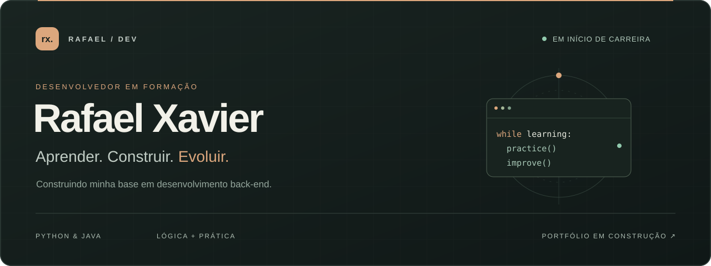
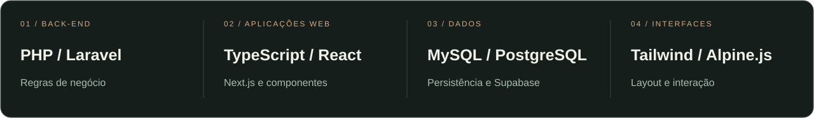
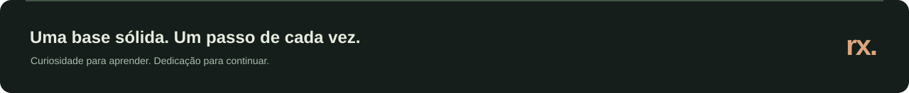

  

  <a href="#sobre">Sobre mim</a> &nbsp; / &nbsp;
  <a href="#tecnologias">Tecnologias</a> &nbsp; / &nbsp;
  <a href="#formacao">Formação</a> &nbsp; / &nbsp;
  <a href="#contato">Contato</a>

 

### 01 &nbsp; / &nbsp; O início de uma trajetória

Sou **Rafael Xavier**, estudante de **Análise e Desenvolvimento de Sistemas na UNIFESO** e desenvolvedor em início de carreira, com interesse em **back-end**.

**Ainda não tenho experiência profissional em desenvolvimento.** Minha base vem dos estudos, de bootcamps e da prática durante o aprendizado. Estou construindo os fundamentos para transformar conhecimento em soluções e conquistar minha primeira oportunidade na área.

Gosto de entender a lógica por trás do código: como organizar uma ideia, resolver um problema e tornar uma solução mais clara. Meu foco agora é fortalecer essa base, praticar com consistência e aprender com feedback.

 

<table>
  <tr>
    <td width="50%" valign="top">
      <strong>MEU FOCO</strong>  
      Desenvolvimento back-end, lógica de programação e organização de código, com estudos em Python e Java.
    </td>
    <td width="50%" valign="top">
      <strong>MEU PRÓXIMO PASSO</strong>  
      Buscar a primeira oportunidade em tecnologia e evoluir com a prática, a colaboração e os desafios de uma equipe.
    </td>
  </tr>
</table>

 

### 02 &nbsp; / &nbsp; Minha base técnica

Estas são as tecnologias que fazem parte da minha formação. **Estou em fase de aprendizado e consolidação dos fundamentos**, sem experiência de uso em um ambiente profissional.

  
<strong>Python &nbsp; ↗ &nbsp; Lógica e back-end</strong>

   

Python é uma das bases do meu aprendizado em programação. Concluí o bootcamp Back-End Python do Santander e sigo aprofundando os fundamentos da linguagem.

**Direção dos estudos:** lógica, funções, estruturas de dados e organização de pequenos programas.

  
<strong>Java &nbsp; ↗ &nbsp; Orientação a objetos</strong>

   

Estou estudando Java para ampliar minha base em desenvolvimento back-end e compreender melhor a construção de aplicações orientadas a objetos.

**Direção dos estudos:** sintaxe, classes, métodos, encapsulamento e organização de responsabilidades.

  
<strong>HTML &amp; CSS &nbsp; ↗ &nbsp; Estrutura e apresentação</strong>

   

Meus conhecimentos iniciais em HTML e CSS complementam o estudo de back-end e ajudam a compreender como uma interface web é construída.

**Direção dos estudos:** HTML semântico, estilização, composição de layouts e responsividade.

  
<strong>Git &amp; GitHub &nbsp; ↗ &nbsp; Versionamento e colaboração</strong>

   

Git e GitHub fazem parte da minha formação para organizar o código, acompanhar alterações e compartilhar o que estou aprendendo.

**Direção dos estudos:** commits claros, branches, documentação de repositórios e fluxo de colaboração.

 

### 03 &nbsp; / &nbsp; Formação em movimento

| Caminho | Instituição / programa | Etapa |
| :--- | :--- | :--- |
| **Análise e Desenvolvimento de Sistemas** | UNIFESO | Cursando |
| **Back-End Python** | Bootcamp Santander | Concluído |
| **Java** | Bootcamp de desenvolvimento | Em andamento |

 

### 04 &nbsp; / &nbsp; Vamos conversar

Estou em busca da minha **primeira oportunidade em desenvolvimento**. Tenho interesse em trocar conhecimento, receber feedback e conhecer equipes que valorizem a formação de novos profissionais.

  <a href="https://www.linkedin.com/in/rafael-xavier-16b1501b9/"><strong>Conecte-se comigo no LinkedIn ↗</strong></a>

 

